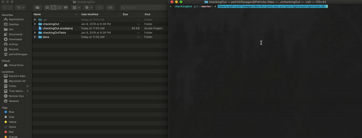

# Ignition

## Demo

## How to Use
Simply run the script from the directory of your `.xcodeproj` and watch your project get ready to roll!

## Required Installations:
pip install pbxproj
^ https://github.com/kronenthaler/mod-pbxproj

gem install bundler

### Fastlane:
https://docs.fastlane.tools/getting-started/ios/setup/

Follow steps of `Installing fastlane` and `Setup environment variables`. You do not need to do anything further.

#### Installing Fastlane:
https://docs.fastlane.tools/getting-started/ios/setup/#installing-fastlane

#### Setup environment variables:
https://docs.fastlane.tools/getting-started/ios/setup/#set-up-environment-variables

## Other notes:
If you want SwiftLint, then you do not need to add it to the `pods` file. The pod will get added with the swiftLint setup steps.

## Setup Instructions
There are several files that you will want to update as you would like.

### .swiftLint.yml
If you would like to use SwiftLint, then you will want to update this file as you would like. In the SwiftLint step, it will copy this file for SwiftLint to use in your project.

### pods
This file should list all of the pods you would like to use. If none, then make sure this is empty.

Note: If you are going to use SwiftLint, it will be added automatically when you are running that step; so there is no need to add it to this file.

### pull_request_template.md
If you are going to add a PR Template, then this is the file that will be used as the template. Feel free to modify as you like.

## License
Copyright 2019 plflanagan

Permission is hereby granted, free of charge, to any person obtaining a copy of this software and associated documentation files (the "Software"), to deal in the Software without restriction, including without limitation the rights to use, copy, modify, merge, publish, distribute, sublicense, and/or sell copies of the Software, and to permit persons to whom the Software is furnished to do so, subject to the following conditions:

The above copyright notice and this permission notice shall be included in all copies or substantial portions of the Software.

THE SOFTWARE IS PROVIDED "AS IS", WITHOUT WARRANTY OF ANY KIND, EXPRESS OR IMPLIED, INCLUDING BUT NOT LIMITED TO THE WARRANTIES OF MERCHANTABILITY, FITNESS FOR A PARTICULAR PURPOSE AND NONINFRINGEMENT. IN NO EVENT SHALL THE AUTHORS OR COPYRIGHT HOLDERS BE LIABLE FOR ANY CLAIM, DAMAGES OR OTHER LIABILITY, WHETHER IN AN ACTION OF CONTRACT, TORT OR OTHERWISE, ARISING FROM, OUT OF OR IN CONNECTION WITH THE SOFTWARE OR THE USE OR OTHER DEALINGS IN THE SOFTWARE.

